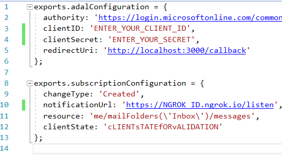

# Microsoft Graph Webhooks Sample for Node.js


Subscribe for [Microsoft Graph change notifications](https://docs.microsoft.com/graph/api/resources/webhooks) to be notified when your user's data changes, so you don't have to poll for changes.

This sample NodeJS web application shows how to subscribe for change notifications as well as how to validate and decrypt change notifications with resource data (preview) when supported by the resource.

[User-delegated authentication](https://docs.microsoft.com/graph/auth-v2-user) represents a user and the application being used when calling the Microsoft Graph. This type of authentication is best suited for scenarios when the user interacts with the application. [Application only authentication](https://docs.microsoft.com/graph/auth-v2-service) represents only the application itself when calling the Microsoft Graph, without any notion of user. This type of authentication is best suited for background services, daemons or other kind of applications users are not directly interacting with.

>See the list of [permissions and authentication types](https://docs.microsoft.com/graph/api/subscription-post-subscriptions?view=graph-rest-1.0) permitted for each supported resource in Microsoft Graph.

The following are common tasks that an application performs with webhooks subscriptions:

- Get consent to subscribe to resources and then get an access token.
- Use the access token to [create a subscription](https://docs.microsoft.com/graph/api/subscription-post-subscriptions) to a resource.
- Send back a validation token to confirm the notification URL.
- Listen for notifications from Microsoft Graph and respond with a 202 status code.
- Request more information about changed resources using data in the notification if no data is provided with the notification.
- Decrypts the resource data provided with the notification if any has been provided with the notification.

## Using the Microsoft Graph Webhooks Sample

### Prerequisites

To use the Webhook sample, you need the following:

- [Node.js](https://nodejs.org/) version 10 or 12.
- A [work or school account](http://dev.office.com/devprogram).
- The application ID and key from the application that you [register on the Azure Portal](#register-the-app).
- A public HTTPS endpoint to receive and send HTTP requests. You can host this on Microsoft Azure or another service, or you can [use ngrok](#ngrok) or a similar tool while testing.
- [OpenSSL](https://www.openssl.org/source/) when trying change notifications with resource data.

> You can install OpenSSL on windows using [chocolatey](https://chocolatey.org/install) with `choco install openssl -y` (run as administrator).

### Create your app

#### Choose the tenant where you want to create your app

1. Sign in to the [Azure portal](https://portal.azure.com) using either a work or school account.
1. If your account is present in more than one Azure AD tenant:
   1. Select your profile from the menu on the top right corner of the page, and then **Switch directory**.
   1. Change your session to the Azure AD tenant where you want to create your application.

#### Register the app

1. Navigate to the [Azure portal > App registrations](https://go.microsoft.com/fwlink/?linkid=2083908) to register your app.
1. Select **New registration**.

   
1. When the **Register an application page** appears, enter your app's registration information:
   1. In the **Name** section, enter a meaningful name that will be displayed to users of the app. For example: `MyWebApp`.
   1. In the **Supported account types** section, select **Accounts in any organizational directory (Any Azure AD directory) and personal Microsoft accounts (e.g. Skype, Xbox)**.
      > You can leave the redirect URI empty, you'll add these from the **Authentication** tab later after the app has been successfully created.

      
1. Select **Register** to create the app.
1. On the app's **Overview** page, find the **Application (client) ID** value and record it for later. You'll need this value to configure the Visual Studio configuration file for this project.
1. In the list of pages for the app, select **Authentication**. (this step is only required if you are using a user-delegated authentication):
   1. In the **Redirect URIs** section, select **Web** in the combo-box and enter the following redirect URIs:
      - `http://localhost:3000/callback`

      
1. Select **Save**.
1. From the **Certificates & secrets** page, in the **Client secrets** section, choose **New client secret**.
   1. Enter a key description (of instance `app secret`).
   1. Select a key duration of either **In 1 year**, **In 2 years**, or **Never Expires**.
   1. When you click the **Add** button, the key value will be displayed. Copy the key value and save it in a safe location.

      You'll need this key later to configure the project in Visual Studio. This key value will not be displayed again, nor retrievable by any other means, so record it as soon as it is visible from the Azure portal.

      

1. In the list of pages for the app, select **API permissions**.
   1. Click the **Add a permission** button and then make sure that the **Microsoft APIs** tab is selected.
   1. In the **Commonly used Microsoft APIs** section, select **Microsoft Graph**.
   1. In the **Application permissions** section, make sure that the **Mail.Read** permission is checked. Use the search box if necessary.
      > Also, in the **Delegated permissions** section, check the User.Read delegated permission for Azure Active Directory, so users can sign into the app to initiate the subscription process.
      > *Note: for other resources you need to select different permissions as documented [here](https://docs.microsoft.com/graph/api/subscription-post-subscriptions?view=graph-rest-beta&tabs=http#permissions)*
      > *Note: depending on which authentication type you chose (app-only or user delegated) you need to select the corresponding permission **from the correct permission type**.*
   1. Select the **Add permissions** button.
   1. Select **Grant admin consent for `name of your organization>`** and **Yes**. This grants consent to the permissions of the application registration you just created to the current organization.

### Set up the ngrok proxy (optional)

You must expose a public HTTPS endpoint to create a subscription and receive notifications from Microsoft Graph. While testing, you can use ngrok to temporarily allow messages from Microsoft Graph to tunnel to a *localhost* port on your computer.

You can use the ngrok web interface (http://127.0.0.1:4040) to inspect the HTTP traffic that passes through the tunnel. To learn more about using ngrok, see the [ngrok website](https://ngrok.com/).

1. [Download ngrok](https://ngrok.com/download) for Windows.

1. Unzip the package and run ngrok.exe.

1. Run the command in the ngrok console.

   `ngrok http 3000 -host-header=rewrite`

   

1. Copy the HTTPS URL that's shown in the console. You'll use this to configure your notification URL in the sample.

   

Keep the console open while testing. If you close it, the tunnel also closes and you'll need to generate a new URL and update the sample.

You'll need the `NGROK_ID` value in the next section.

>See [troubleshooting](./TROUBLESHOOTING.md) for more information about using tunnels.

### Configure and run the sample

1. Use a text editor to open `constants.js`.
1. Replace `ENTER_YOUR_CLIENT_ID` with the client ID of your registered Azure application.
1. Replace `ENTER_YOUR_TENANT_ID` with the ID of your organization. This information can be found next to the client ID on the application management page.
1. Replace `ENTER_YOUR_SECRET` with the client secret of your registered Azure application.
1. Replace `NGROK_ID` with the value in *https public URL* from the previous section.

1. You can also update the following settings to change the subscription property:
    - **ChangeType**: CSV; possible values created, updated, deleted.
    - **Resource**: resource to create subscription for (e.g. teams/allMessages).
    - **IncludeResourceData**: whether the notifications should include resource data. `true` or `false`
1. Install the dependencies running the following command:

    ```Shell
    npm install
    ```

1. Start the application with the following command:

    ```Shell
    npm start
    ```
    > **Note:** You can also make the application wait for a debugger. To wait for a debugger, use the following command instead:
    >
    > ```Shell
    > npm run debug
    > ```
    > You can also attach the debugger included in Microsoft Visual Studio Code. For more information, see [Debugging in Visual Studio Code](https://code.visualstudio.com/Docs/editor/debugging).

1. Open a browser and go to [http://localhost:3000](http://localhost:3000).

### Use the app to create a subscription

#### Sign-in and grant permissions

> Note: you need to go through the following steps only if you are trying to create a subscription with **user-delegated** application.

1. Choose **Sign in** sign in with a work or school account.

1. Consent to the **View your basic profile** and **Sign in as you** permissions.

1. On the sample home page, choose **Grant admin consent**. You'll be redirected to the *adminconsent* page.

1. Sign in as a tenant admin and consent to the **Read mail in all mailboxes** and **Sign in and read user profile** permissions. You'll be redirected back to the sample's home page.

   At this point, any user in your tenant can sign in and create a subscription. If you don't grant admin permissions first, you'll receive an *Unauthorized* error. You'll need to open the sample in a new browser session because this sample caches the initial token.

After completing the steps documented above, the subscription will be created and you will be redirected to a page displaying any notification being received.

#### Creating the subscription

> Note: you need to go through the following steps only if you are trying to create a subscription with **app-only** application.

1. Choose **Create subscription**. The **Subscription** page loads with information about the subscription.

   >This sample sets the subscription expiration to 60 minutes for testing purposes.

After completing the steps documented above, the subscription will be created and you will be redirected to a page displaying any notification being received.

## Troubleshooting

See the dedicated [troubleshooting page](./TROUBLESHOOTING.md).

## Contributing

If you'd like to contribute to this sample, see [CONTRIBUTING.MD](/CONTRIBUTING.md).

This project has adopted the [Microsoft Open Source Code of Conduct](https://opensource.microsoft.com/codeofconduct/). For more information see the [Code of Conduct FAQ](https://opensource.microsoft.com/codeofconduct/faq/) or contact [opencode@microsoft.com](mailto:opencode@microsoft.com) with any additional questions or comments.

## Questions and comments

We'd love to get your feedback about the Microsoft Graph Webhook sample. You can send your questions and suggestions to us in the [Issues](https://github.com/microsoftgraph/nodejs-webhooks-rest-sample/issues) section of this repository.

Questions about Microsoft Graph in general should be posted to [Stack Overflow](https://stackoverflow.com/questions/tagged/MicrosoftGraph). Make sure that your questions or comments are tagged with *[MicrosoftGraph]*.

You can suggest changes for Microsoft Graph on [UserVoice](https://microsoftgraph.uservoice.com/).

## Additional resources

- [Microsoft Graph Webhooks sample for ASP.NET core](https://github.com/microsoftgraph/aspnetcore-webhooks-sample)
- [Microsoft Graph Webhooks sample for Java Spring](https://github.com/microsoftgraph/java-spring-webhooks-sample)
- [Working with Webhooks in Microsoft Graph](https://docs.microsoft.com/graph/api/resources/webhooks)
- [Subscription resource](https://docs.microsoft.com/graph/api/resources/subscription)
- [Microsoft Graph documentation](https://docs.microsoft.com/graph)

## Copyright

Copyright (c) 2019 Microsoft. All rights reserved.
